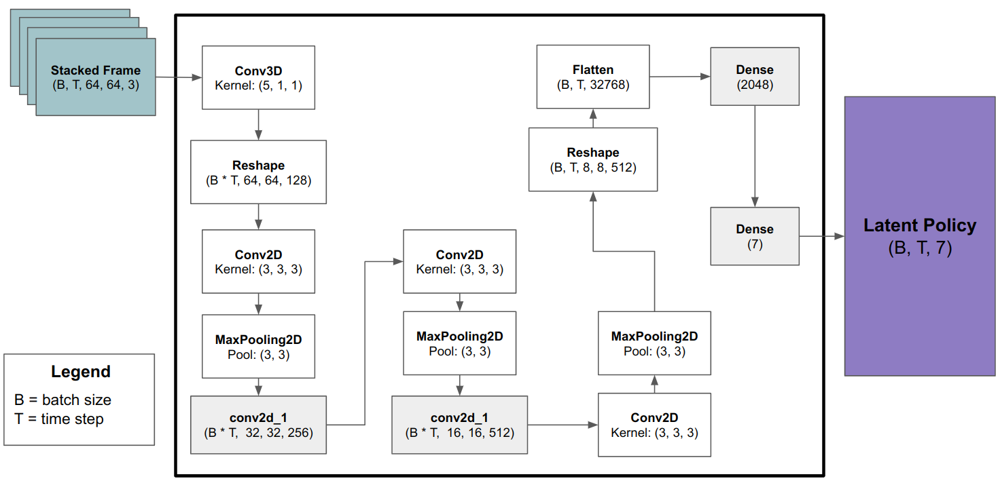
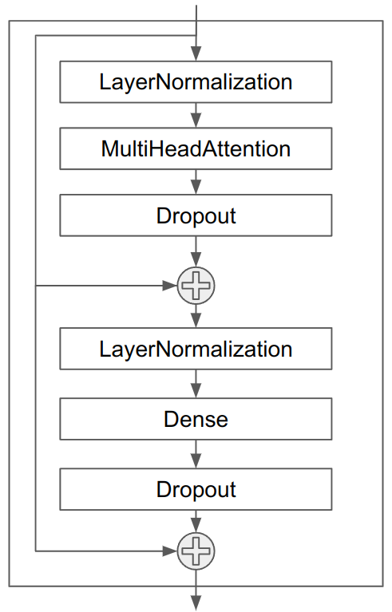

# Introduction
Implementation of the [Genie: Generative Interactive Environments](https://deepmind.google/research/publications/60474/) based on the Reproducible Case Study of the paper. 

# Reference
1. Procgen Benchmark of OpenAI: https://github.com/openai/procgen
2. World Models: https://github.com/zacwellmer/WorldModels
3. Transformers are Sample-Efficient World Models: https://github.com/eloialonso/iris
4. Vector-Quantized Variational Autoencoders Keras: https://keras.io/examples/generative/vq_vae/

# Version
1. Python3.9
2. Tensorflow 2.14.0
3. tensorflow_probability 0.22.0

# Network architecture
## Latent Action Model


## Video Tokenizer


## Dynamics Model
### Attention Block


### Attention Stack


### World Model

# How to train the model?
## Collect data
```
$ python 
```

## Training the Latent Action Model
```
$ python 
```

## Training the Video Tokenizer
```
$ python 
```

## Training the Dynamics Model
```
$ python 
```

# How to test the model?
```
$ python learner.py --env_num 4 --gpu_use True --model_name fullyconv  --gradient_clipping 10.0
```
