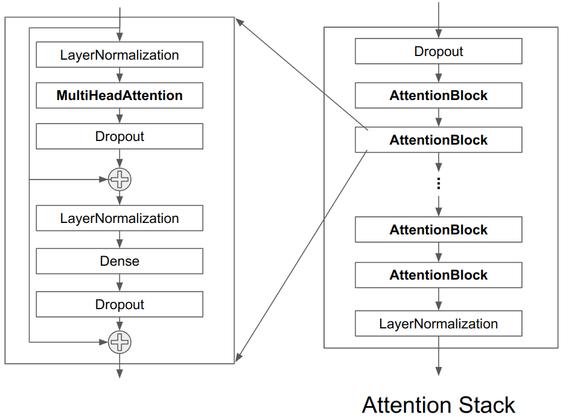
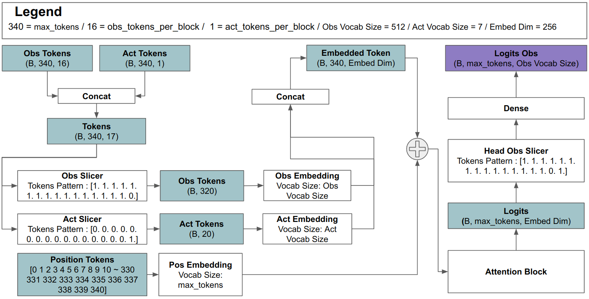

# Introduction
Implementation of the [Genie: Generative Interactive Environments](https://deepmind.google/research/publications/60474/) based on the Reproducible Case Study of the paper. 

# Reference
1. Procgen Benchmark of OpenAI: https://github.com/openai/procgen
2. World Models: https://github.com/zacwellmer/WorldModels
3. Transformers are Sample-Efficient World Models: https://github.com/eloialonso/iris
4. Vector-Quantized Variational Autoencoders Keras: https://keras.io/examples/generative/vq_vae/

# Version
1. Python3.9
2. Tensorflow 2.14.0
3. tensorflow_probability 0.22.0

# Network architecture
## Latent Action Model


## Video Tokenizer


## Dynamics Model
### 1. Attention Block & Stack 


### 2. World Model(When Training the model)


### 3. Attention Mask


### 4. Mechanism of Multi-Head Attention Masking


### 5. Tokens flowing when generating the world


# How to train the model?
## 1. Collect data
The training data is OpenAI Procgen's CoinRun game data. Use the ```extract.py``` file, but to improve collection speed, you can run multiple files simultaneously with the command below.
```
$ ./data_collect.bash
```

The data is saved in ```npy``` format with a random name under the ```record``` folder in the working directory. Therefore, please check if it works by opening it.

## 2. Training the Latent Action Model
Next, let's train a model to find out what actions were performed in image frames. The file is designed to be run in the Jupyter Notebook file, ```vq_vae_coinrun.ipynb```. Thus, the training situation can be monitored in real time.
```
$ python idm_training.py
```
The trained model is saved in the ```IDM_Model_{epoch}``` name under the model folder in the working directory every 10 epochs. Please make sure to check if it works well by checking the folder.

## 3. Training the Video Tokenizer
Next, let’s learn a model that converts the image frame into a token.
```
$ Jupyter Notebook 
```

The trained model is saved in the ```CoinRun_VAVAE_Model_{0}.ckpt``` name under the model folder in the working directory every 10 epochs. Please make sure to check if it works well by checking the folder.

## 4. Training the Dynamics Model
After training both the previous two models, it is now time to train the Genie model. First, open the ```dream_train_tf.py``` file and then change the paths below to the file names you want to use.

```
tokenizer_tf.load_weights("model/CoinRun_VAVAQ_Model_60.ckpt")
world_model.load_weights("model/world_model_1")
```

After making the change, let's start training.
```
$ python dream_train_tf.py 
```

The trained model is saved in the ```world_model_{epoch}``` name under the model folder in the working directory every 10 epochs. Please make sure to check if it works well by checking the folder.

# How to test the model?
After training the dynamic models, please open the ```dream_play_tf.py``` file and then change the paths below to the file names you want to use.

```
tokenizer_tf.load_weights("model/CoinRun_VAVAQ_Model_60.ckpt")
world_model.load_weights("model/world_model_2")
```

After making the change, let's start testing. You can control the agent using the `w`, `a', and 'd' keys.
```
$ python dream_play_tf.py 
```

Because the current model is at a basic level, it only works for a single game-level generation.


You can also download and check the above result yourself using the [pre-traied model](https://drive.google.com/drive/folders/1lZuT-IotB8hd-BlVraYBuCqpBxjPJUXq?usp=drive_link).


# Detailed information
I am writing an explanation for code at Medium as a series.

1. Base Structure: https://dohyeongkim.medium.com/deepmind-genie-implementation-series-1-base-structure-47727338cc1a
